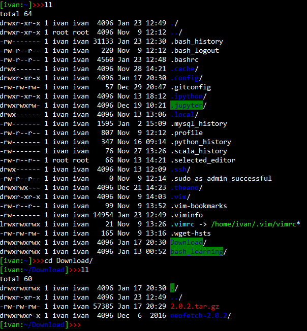
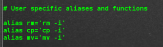
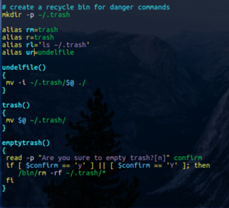
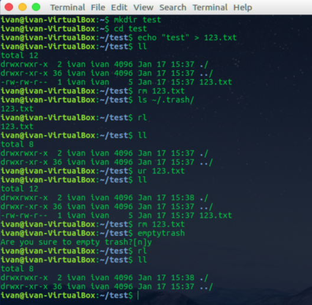
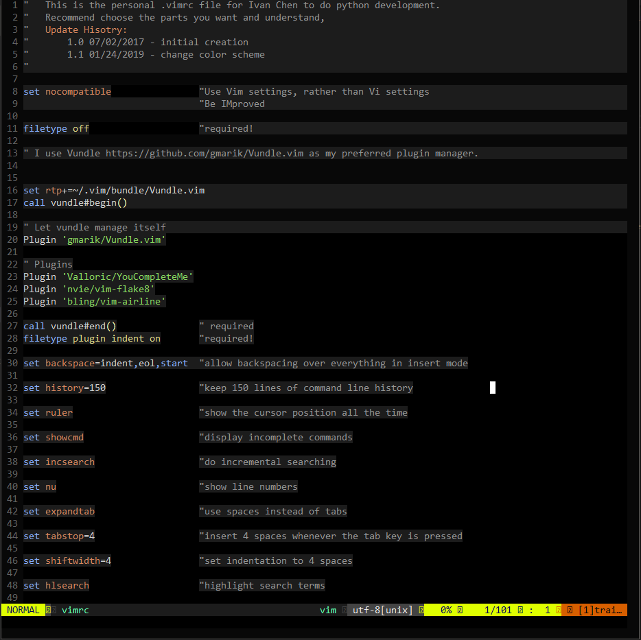

# Linux Personalization

## Shell Environment Setup

### Monitoring Systems
There are a lot of shell applications you can use to help you to monitor system services, network, IO, processes and etc. It depends on what you are going to monitor. If just for Linux system performance, the one I will recommend is htop. It is similar to top, but more beautiful and easier to operate. 

When I use tmux to manage windows and sessions, I would like to open a windows to run htop. Nothing special, just like its simplicity and colorful. Another option for Linux system performance is glances. It was designed to present performance information as much as possible within a small window space. However, my personal feeling is it is more like summary/statistic report rather than a real-time monitoring tool. It may be useful if you take some snapshots on it and analyze your system performance later on.

Actually, for statistic information on system performance, I would like to use dstat, which aims to be a replacement
forvmstat, iostat, netstat and ifstat. It is real-time information and can export data into a csv file. This allows users
to analyze the performance data easily.

For monitoring system IO specifically, I would like to use iotop. It is straightforward and easy to handle.

* [htop](https://www.howtogeek.com/howto/ubuntu/using-htop-to-monitor-system-processes-on-linux/)
* [glances](https://nicolargo.github.io/glances/)
* [dstat](https://www.tecmint.com/dstat-monitor-linux-server-performance-process-memory-network/)
* [iotop](https://www.tecmint.com/iotop-monitor-linux-disk-io-activity-per-process/)

### File System Management
If you started learning computer staff around 90s, you probably knew a lot of DOS things, like me :). If this is the case to you, you must understand why I pick Midnight Commander (mc) as my favorite for file system management.

[midnight commender (mc)](https://midnight-commander.org/)

### Screen and Seesions Management
If you need to work in a shell environment for a long time, you probably would like to have a multi-window terminal. tmux is a type of the application to help you to define your own windows and sessions. GNU Screen is also another good option, however, tmux is my favorite. It may take a little while to learn and get used to it, but it is really great when you can handle it.

[tmux](https://hackernoon.com/a-gentle-introduction-to-tmux-8d784c404340)

### Email
There are also a lot of options on email management. I like [alpine](http://alpine.x10host.com/alpine/) and [mutt](https://www.tecmint.com/send-mail-from-command-line-using-mutt-command/). I tried [notmuch](https://notmuchmail.org/) but not like it very much. The major reason for me is simple and easy to handle, like Thunderbird.

However, Google gmail settings in those email client tools isn't quite as easy as it used to be. I need to enable "Less Secure Apps" on my gmail account, which is not recommended by Google. For more detailed info about Google gmail smtp setting is [here](https://www.wpsitecare.com/gmail-smtp-settings/).

For mutt, my config file .muttrc is edited with vim by adding the follow lines:

```shell
set imap_user = "chen115yaohua@gmail.com"
set imap_pass = ""
set smtp_url = "smtp://chen115yaohua@smtp.gmail.com:587/"
set smtp_pass = ""
set from = "chen115yaohua@gmail.com"
set realname = "Ivan Chen"
set folder = "imaps://imap.gmail.com:993"
set spoolfile = "+INBOX"
set postponed = "+[Gmail]/Drafts"
set header_cache = ~/.mutt/cache/headers
set message_cachedir = ~/.mutt/cache/bodies
set certificate_file = ~/.mutt/certificates
set move = no
set smtp_authenticators = 'gssapi:login'
```

### Web Browser
I usually don’t need too much fancy functionalities when I browse web pages. Lynx meets my needs. I tried some other options, such as w3m, however, I still like lynx due to its simplicity and easy handling.

[lynx](https://lynx.browser.org/)

### Calculator
Actually, I didn’t try much on this one. bc works and meets most of my needs.

[bc](https://www.gnu.org/software/bc/manual/html_mono/bc.html)

### Text Editor
There are a lot of options on text editing. This one would totally depends on your preferences and what you are working on. So, different people would have different favorites. For me in the most of time, I just need to edit some simple text files, such as configuration files or small sh files. I like to use, not emacs, not vim or vi,BUT nano. It is very simple, very ease to learn, and very convenient to use. It maybe the reasons that Ubuntu includes it in their default distributions.

* [nano](https://www.nano-editor.org/) 
* [vim](https://en.wikipedia.org/wiki/Vim_(text_editor))

You can use text editor, such as nano mentioned above, for proramming type of tasks. However, you won’t enjoy your work if you use nano on programming or editing a large document. You need a tool with a lot of functionalities to help you. Vim will be the one for me (I don’t think there will be too many people to disagree me on this one ^_^). The main reasons for me would be its huge amount of useful plugins/add-on. You can customize your vim to meet your special needs by downloading and installing the plugins that you like the most.

### Music Player
I usually don’t listen music when I am working on something very hard. However, if I have to, I will pick cmus due to its efficiency and less system resources used. There are definitely other interesting options, such as mp3, ogg, etc. I didn’t try much.

[cmus](https://cmus.github.io/)

### Terminal Login Greeting
I would like to display some operating system information, including software and hardware info in a visually pleasing way after I login or open terminal. In this case, I like neofetch that is configurable and beautiful.

[neofetch](https://github.com/dylanaraps/neofetch)

I created a [greeting.sh](./Bash_Env/greeting.sh) file containing some functions to display my own custom-built messages.

## Bash Shell Configuration
Modify .bashrc (an [example](./Bash_Env/.bashrc) at Bash_Env folder) file to personalize the terminal prompt with different symbol, format and colors. The setting is:
```shell
    PS1='${debian_chroot:+($debian_chroot)}\[\033[01;32m\][\u:\[\033[01;34m\]\w\e[01;32m]\[\033[01;31m\]>>>\e[01;37m'
```

The final result can be like the following figure.

<a></a>

Modify it by adding alias and functions, such as something like below.

<a></a>

<a></a>

<a></a>

## Vim Configuration
Modify vimrc file by using the [example](./Vim/vimrc) provided in this repo. The vim should look like:

<a></a>
