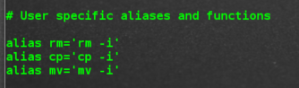
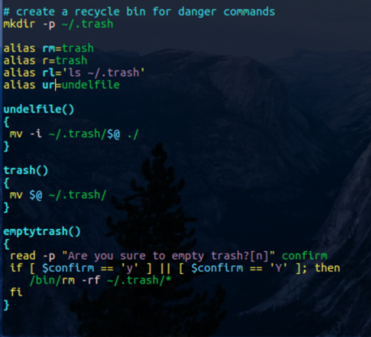
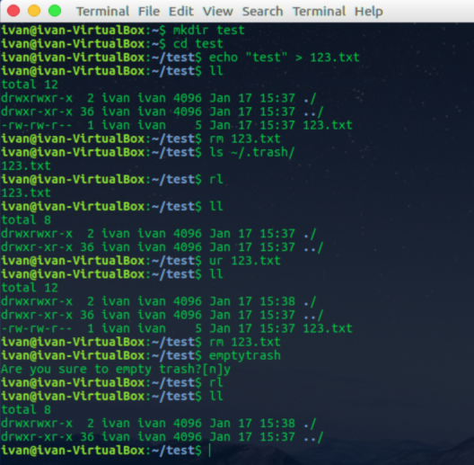
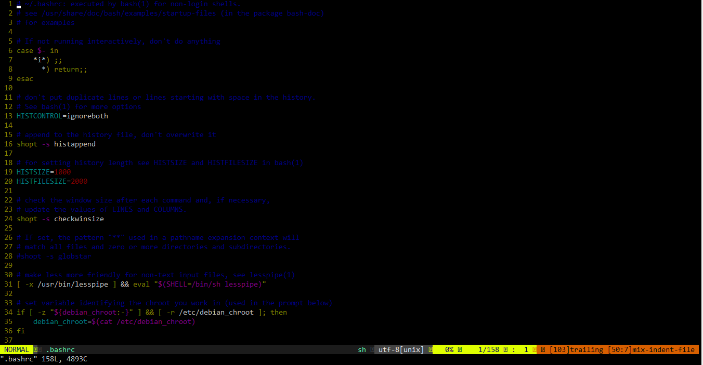

# Linux_Personalization

## Bash Shell Configuration
Modify .bashrc file by adding alias and functions, such as something like below.

## Vim Configuration
Modify vimrc file by using the [example](./vimrc) provided in this repo. The vim should look like:

